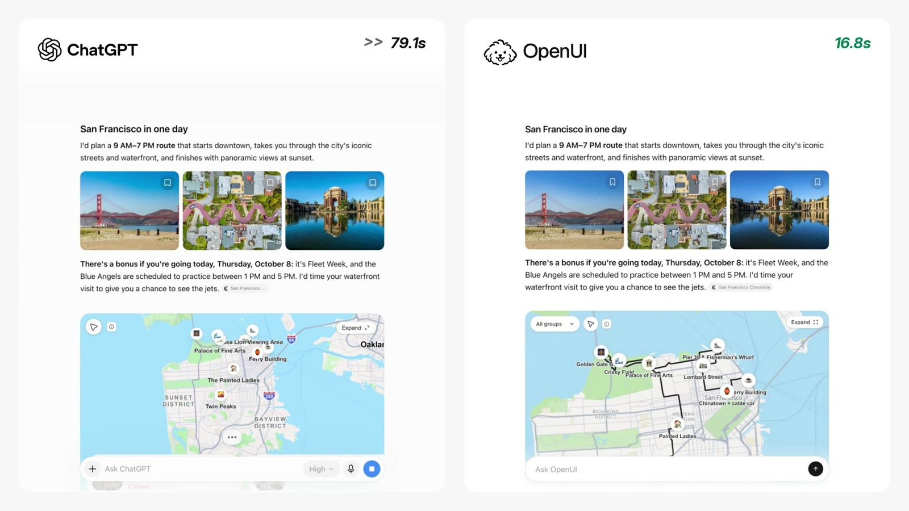

# Open Intelligent UI

**An open-source implementation of the "Intelligent UI" experience introduced in ChatGPT, built on [OpenUI](https://openui.com).**

In ChatGPT's Intelligent UI, a request such as "plan a day in San Francisco" returns an interactive answer (a map, photographs and an editable itinerary) rather than text. This repository reproduces that experience with open-source components, so that the same kind of interface can be built, modified and shipped inside any application.

[OpenUI](https://github.com/thesysdev/openui) is the open standard for Generative UI.

> This project is independent and is not affiliated with or endorsed by OpenAI. "Intelligent UI" refers to the ChatGPT feature that this demo recreates.

## Demo video

ChatGPT's Intelligent UI (left) and this project (right) answering the same request. Select the image to play the video.

[](docs/openui-chatgpt-comparison.mp4)

## What's in the demo

The model streams OpenUI Lang through OpenUI Gateway, and the app renders it as an answer built from custom travel components. They are defined in this repository (`src/lib/travel/components.tsx`) with OpenUI's `defineComponent` and registered alongside OpenUI's built-in chat components:

- `TravelHeading` and `TravelProse`: editorial headings and paragraphs with streaming word fades.
- `TravelImage` and `TravelGallery`: a three-photo strip using Gateway image-search results, with Wikipedia fallbacks.
- `TravelStop` and `TravelItinerary`: destination data and compact photo/text rows, sharing the same stop references with `TravelMap`.
- `TravelMap`: a [MapLibre GL](https://maplibre.org) street map with emoji pins, category filters, expansion and map-to-itinerary selection. Pins appear while the answer streams; once it ends, the map frames the route and draws its line.
- `TravelSuggestions`: extra places with "+ Add to my route". Adding one puts a pin on the map and appends it to the itinerary; every stop can also be removed and added back.

The "Customize your route" form at the end of each answer uses OpenUI's built-in form components (`Form`, `RadioGroup`, `CheckBoxGroup`, `Button`) and sends the chosen preferences back to the model with `@ToAssistant`.

## Setup

Requires Node 24.

```bash
cp .env.example .env.local   # add your THESYS_API_KEY
npm install
npm run dev
```

Open http://localhost:3000 and try: `I'm in San Francisco for a day, plan a sightseeing route for me`

| Variable | Required | Purpose |
| --- | --- | --- |
| `THESYS_API_KEY` | Yes, unless using Ollama | OpenUI Gateway key, used only on the server. |
| `THESYS_MODEL` | No | A `{provider}/{model}` id. Defaults to `openai/gpt-5.5`. |
| `MODEL_PROVIDER` | No | Set to `ollama` to run a local model instead of Gateway; see [Run with a local model](#run-with-a-local-model-ollama). |
| `OLLAMA_MODEL` | No | The Ollama model to use. Defaults to `qwen3.8:27b`. |
| `OLLAMA_BASE_URL` | No | Ollama's OpenAI-compatible endpoint. Defaults to `http://localhost:11434/v1`. |

## Run with a local model (Ollama)

The demo can also run on a local model through [Ollama](https://ollama.com), with no API key required.

You can use **OpenUI / Open Intelligent UI** with any local LLM provider, including:
- [Ollama](https://ollama.com)
- [LM Studio](https://lmstudio.ai)
- [Unsloth Studio](https://unsloth.ai)
- [AnythingLLM](https://anythingllm.com)

We also have an [OpenWebUI plugin](https://github.com/thesysdev/openwebui-plugin) that can be set up with Open Intelligent UI.
1. Install Ollama and pull a model. The default is `qwen3.8:27b` (about 18 GB, best with 32 GB of memory or more); `gpt-oss:20b` and `qwen3:8b` are smaller alternatives.

   ```bash
   ollama pull qwen3.8:27b
   ```

2. Give the model a larger context window. The OpenUI prompt for this app is about 15,000 tokens, and Ollama's default window is 4,096, which silently cuts the prompt and produces broken output. Either start Ollama with a larger default:

   ```bash
   OLLAMA_CONTEXT_LENGTH=32768 ollama serve
   ```

   or create a model variant with a larger window and use its name as `OLLAMA_MODEL`:

   ```bash
   printf 'FROM qwen3.8:27b\nPARAMETER num_ctx 32768\n' > Modelfile
   ollama create qwen3.8-32k -f Modelfile
   ```

3. In `.env.local`, set `MODEL_PROVIDER=ollama` (and `OLLAMA_MODEL` to use another model), then `npm run dev`.

What changes with a local model:

- **No image search.** Gateway's hosted `image_search` is not available, so photos come from Wikipedia.
- **No output correction.** Gateway validates and corrects the generated OpenUI Lang; locally, the model's output is rendered as written, so larger models give better results.
- **Speed depends on your hardware.** The first request after Ollama loads the model has to read the whole prompt; later requests reuse it and are much faster. For reasoning models, `REASONING_EFFORT=low` cuts the wait considerably. 
## How it works

- **Generation.** `/api/chat` calls OpenUI Gateway's Responses API with `generateSystemPrompt({ cloud: true })`, so Gateway validates and corrects the generated OpenUI Lang against this app's component library. Gateway's hosted `image_search` tool finds current photos; the model copies the returned URLs into `TravelImage.src` and `TravelStop.imageUrl`.
- **Chat Completions.** OpenUI Gateway also supports the Chat Completions API, and OpenUI works with either. This example uses the Responses API because Gateway's hosted tools, such as `image_search`, are available only there. An application already built on Chat Completions can keep that protocol and pair it with `openAIReadableStreamAdapter` or `openAIAdapter` in the browser.
- **Photos.** Each photo falls back to Wikipedia when it has no URL or its image fails to load. A gallery photo with no working image at all is dropped so the others fill the row.
- **Route edits.** Removed stops, added suggestions and the selected stop live in OpenUI's response state (`useStateField`), so `AgentInterface` saves them with the message. `/api/chat` turns them into a short note so the model knows the user's current route on the next turn.
- **Map data.** Wikipedia lookups and street-route geometry go through the app's own server routes, `/api/wiki` and `/api/street-route`, which validate input and cache results. Street geometry comes from the public OSRM demo server's driving profile: a road overview, not walking or transit directions. When it's unavailable, a labelled direct connection is drawn instead.
- **Theme.** Colors, type, radii, shadows and chat bubbles are theme tokens, applied once through `AgentInterface`'s `theme` prop. All the stylesheets read those tokens rather than repeating their values.

## Project structure

| File | Purpose |
| --- | --- |
| `src/app/layout.tsx` | Root layout: page metadata, the Inter font and `globals.css`. |
| `src/app/page.tsx` | The chat page. Renders `AgentInterface` with the component library, theme, welcome screen and starter prompts, and connects it to `/api/chat`. |
| `src/app/globals.css` | Global CSS reset. |
| `src/app/shell.css` | Restyles the `AgentInterface` shell (sidebar, composer, starters, message bubbles), using theme tokens where they exist. |
| `src/app/api/chat/route.ts` | Chat endpoint. Validates the request, forwards the conversation to OpenUI Gateway with image search enabled (or to a local Ollama model when `OLLAMA_MODEL` is set), and streams the response back. |
| `src/app/api/wiki/route.ts` | Wikipedia lookup: photos and coordinates for a place, cached on the server. |
| `src/app/api/street-route/route.ts` | Street geometry between stops from OSRM, cached on the server. |
| `src/lib/library.ts` | The OpenUI component library: OpenUI's chat components plus the travel components, with the Travel group's layout note. |
| `src/lib/prompt-options.ts` | Extra prompt examples and rules for travel answers, added on top of OpenUI's defaults, with a variant for local models that have no image search. |
| `src/lib/response-theme.ts` | Theme tokens (colors, fonts, radii, shadows, chat bubbles), built with `createTheme()`. |
| `src/lib/response-theme.css` | Styles OpenUI's built-in components inside answers (buttons, forms, tabs, tables), and defines the `--iui-*` aliases the travel styles use. |
| `src/lib/route/root.tsx` | The `Card` root every answer renders inside; accepts the travel components as children. |
| `src/lib/route/route.css` | Layout of the answer container. |
| `src/lib/route/store.ts` | `useRouteStore()`: route edits kept in OpenUI's response state, plus the client side of the Wikipedia lookup. |
| `src/lib/travel/components.tsx` | The travel components the model can generate (`defineComponent` + Zod schema each), plus photo fallback logic. |
| `src/lib/travel/map.tsx` | The map behind `TravelMap`: pins, filter, expand, framing and the route line. |
| `src/lib/travel/map-utils.ts` | Map helpers: coordinates, bounds, partial lines for the draw animation, pin elements and the emoji check. |
| `src/lib/travel/use-street-route.ts` | Hook that loads street geometry from `/api/street-route` in the background. |
| `src/lib/travel/use-dialog.ts` | Hook for the expanded map dialog: scroll lock, focus trap, Escape to close. |
| `src/lib/travel/vector-basemap.ts` | Loads MapLibre and defines the vector map style and the raster fallback style. |
| `src/lib/travel/travel.css` | Styles for the travel components and map. |
| `src/generated/spec.json` | Library spec sent to Gateway in the system prompt. Regenerate with `npm run generate` after changing a component schema. |
| `docs/openui-chatgpt-comparison.mp4` | Side-by-side video of ChatGPT and this project; `docs/openui-chatgpt-comparison.jpg` is its README preview. |
| `.env.example` | The environment variables to copy into `.env.local`. |

## Checks

```bash
npm run generate       # after changing a component schema
npx tsc --noEmit
npm run build
```

Then try the San Francisco prompt and another city such as Lisbon. Check the photo strip, pins appearing during the stream, the route reveal, map filters and expansion, adding and removing places, and the customize form, on desktop and mobile.
